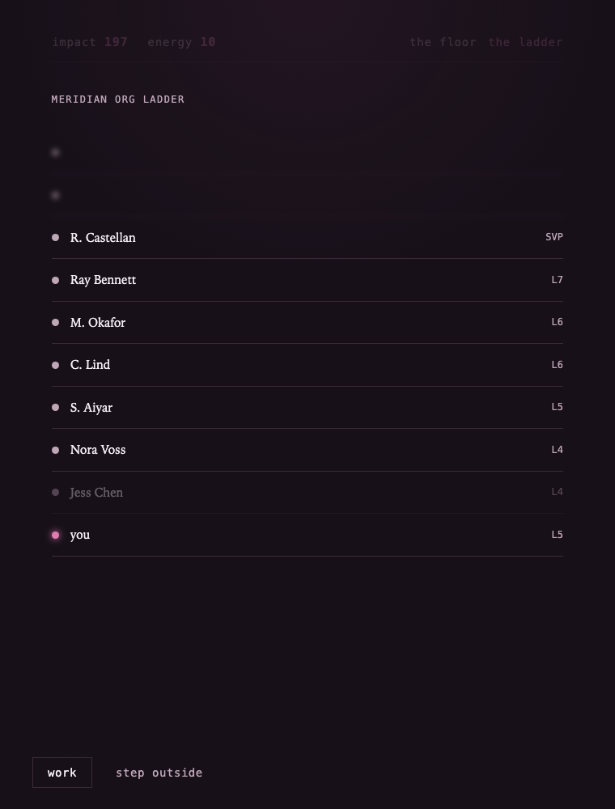
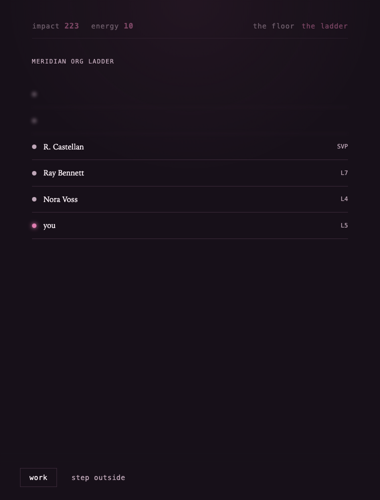
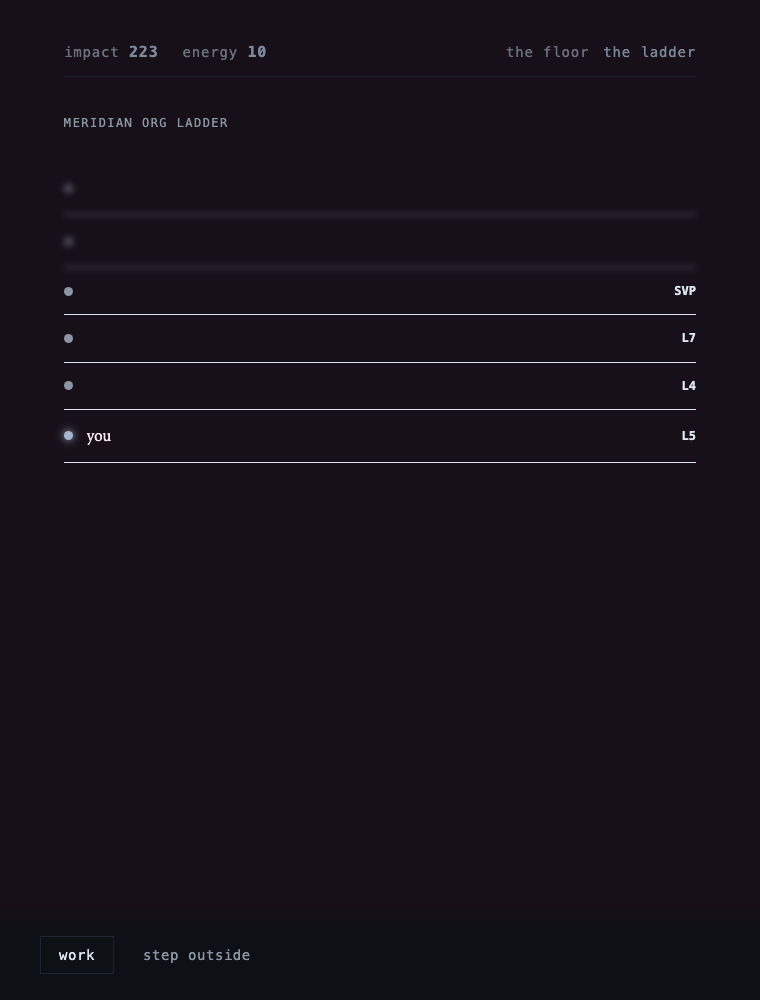

# Overtime

A text-driven strategy game in the lineage of *A Dark Room* — climb the ladder
at a prestigious tech company through a series of small, escalating choices.
No accounts, no backend, no tracking. Single HTML file, runs entirely in the
browser.

## Play it

```bash
git clone https://github.com/beautifulgownss/overtime.git
cd overtime
open index.html   # macOS; double-click the file on Windows/Linux
```

No build step, no dependencies. That's the whole install.

If this repo is pushed to GitHub with Pages enabled (Settings → Pages →
deploy from `main` / root), it's playable directly at:

```
https://beautifulgownss.github.io/overtime/
```

## Screenshots

  
*The cold open.*

  
*After a promotion. Jess, dimmed.*

  
*After the layoff, clean path.*

  
*The same moment, cold path.*

## Status

In development — Acts I through III of a planned five-act structure are
playable:

- **Act I, "The Offer":** cold open, core work loop, first characters, the
  roadmap review (Fork 1), the performance cycle, the ladder unlock.
- **Act II, "The Climb":** the postmortem (Fork 2), a confidence from Ray,
  the tiger team (Fork 3), the senior promotion, and the Act III teaser.
- **Act III, "The Pillar":** the zero-sum promotion, the layoff, Nora's
  resolution, and the register/ladder inversion. Act III currently ends
  here — the closing beat and the Act IV transition aren't written yet.

## How it works

The game has no visible morality stat. Choices at forks shift an internal
register, and the register rewrites the game around you:

- **Narration** — the same events are described in warmer or colder prose
  depending on who you're becoming.
- **The interface** — the color palette drains from dark pink toward cold
  gray-blue as choices accumulate. The transition is slow on purpose.
- **The world** — how other people's decisions get framed, which names dim
  on the ladder, what the log bothers to mention.

## Structure

The game itself is `index.html` and nothing else — engine code and narrative
content are separated into clearly marked sections within the file so the
writing can grow without touching the engine:

- **STATE / REGISTERS / LOG / ACTIONS / FORKS / SCHEDULER / LADDER / COCOON**
  — engine systems, documented inline. Forks are registered by id and
  persist across reloads, including mid-decision.
- **CONTENT** — all narrative: log lines, fork text, character beats,
  triggers. This is where most future work happens.

`scripts/` and `screenshots/` are dev tooling (screenshot generation for
this README) — neither is loaded by the game and neither is needed to play
it.

## Notes

No build step, no dependencies, no server required. Edit `index.html`,
refresh the browser. A local server is optional but avoids browser quirks
with `file://` paths:

```bash
python3 -m http.server 8000
# then open http://localhost:8000
```

Progress saves to the browser's `localStorage` automatically, including
decisions in progress. Clearing site data resets the game.

## Writing rules

For anyone (or any model) contributing prose:

- No em dashes in player-facing text.
- Every word earns its place. Understatement over lyricism.
- The observation does the work; the narrator never editorializes.
- The register system cools the *narration*, not the world. Other
  characters don't change; how she sees them does.
